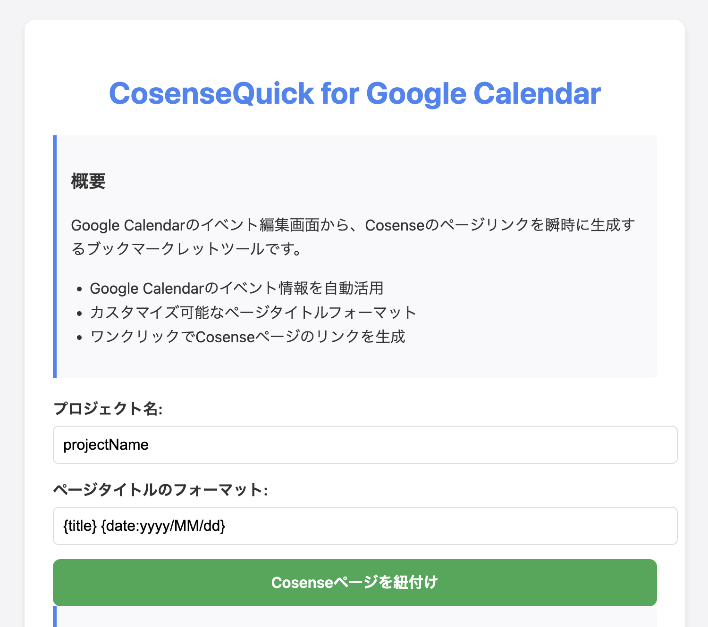

# CosenseQuick-for-Google-Calendar

## 概要

Googleカレンダーのイベント編集ページでイベントの情報に紐づいたCosenseページを生成する動線を省力化するためのブックマークレットです。

## ページリンク

https://cti1650.github.io/CosenseQuick-for-Google-Calendar/

## スクリーンショット

## 備考

以下のリンクのようにクエリパラメータで初期値を指定できるようになっています。

[https://cti1650.github.io/CosenseQuick-for-Google-Calendar/?project=projectName&format={title}%20{date}](https://cti1650.github.io/CosenseQuick-for-Google-Calendar/?project=projectName&format={title}%20{date})

パラメータ名|概要|記述例
:-|:-|:-
project|プロジェクト名|`projectName`
format|ページタイトルのフォーマット|`{title} {date}`
